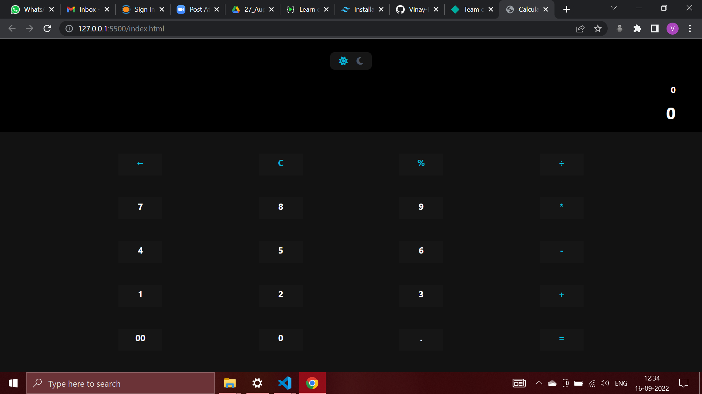

# **Calculator App Using the JS**
## **Overview**
This is a simple calculator app which is able to perform the basic calculation from addition to percentage. It can easily handle the large input and ouput calculation easily.  
This project is responsive for all the devices like PC and Mobile.  
This project also contains the Dark and Light mode for a better viewing experience. You can switch the mode by pressing the buttons of the light and dark mode on the top.

## **Technology Used**
1. HTML
2. Tailwind CSS
3. JavaScript
4. Mathjs Library of JS

## **Output**

## **Live Link**
